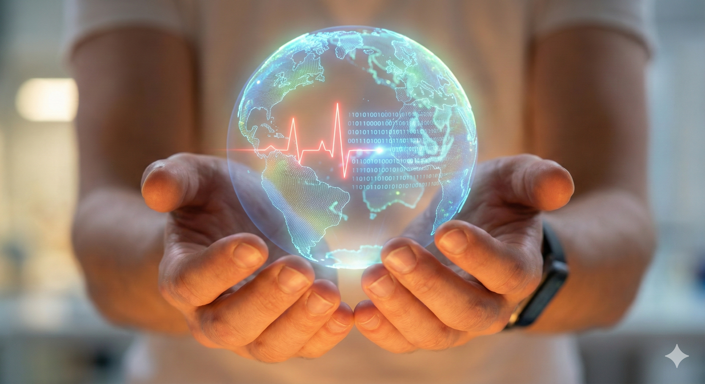

# UAS-1 My Concepts

**Pulse of The Planet: Menyelaraskan Detak Jantung Global Lewat TISE**

{width="100%"}

## Refleksi dari "Minus": Ketika Sehat adalah Kemewahan

Tumbuh di lingkungan yang "berangkat dari minus" mengajarkan aku satu hal pahit: kesehatan adalah benteng pertahanan terakhir sebuah keluarga. Ketika sakit menyerang keluarga yang rentan, ia bukan hanya masalah medis, tapi bencana ekonomi.

Aku melihat data ini bukan sekadar angka: 4,5 miliar manusia—separuh populasi bumi—belum mendapatkan layanan kesehatan esensial, dan ratusan juta jatuh miskin hanya karena berusaha untuk sembuh. Bagi mereka, dan bagi masa laluku, sehat adalah sebuah *privilese*, bukan hak.

Konsep "Mahakarya" yang aku tawarkan bukanlah tentang menciptakan robot canggih yang menggantikan sentuhan manusia, melainkan sebuah **Sistem TISE (Triune-Intelligence Smart Engineering)** yang mendemokratisasi akses. Aku menamainya **"Pulse of The Planet"** (Detak Jantung Planet)—sebuah upaya menyelaraskan tiga komponen kecerdasan agar jantung kemanusiaan tetap berdetak, tak peduli seberapa "minus" kondisi ekonominya.

## Arsitektur TISE: Pulse of The Planet

Untuk menggerakkan 8 miliar manusia menuju keadilan kesehatan, kita perlu menyelaraskan tiga elemen fundamental:

### 1. Hati (Kecerdasan Manusia / *Homocordium*) — *The Compass of Care*

Ini adalah **Axiological Intelligence (AQ)** kolektif kita. Dalam konteks kesehatan global, "Hati" adalah kompas moral yang berteriak bahwa akses kesehatan adalah hak asasi.

* **Masalah:** Kita mengalami krisis empati. Teknologi medis maju, tapi distribusinya macet karena motif profit.
* **Konsep TISE:** *Homocordium* berfungsi menentukan "Mengapa" kita bertindak. Tanpa Hati yang selaras melalui **Komunikasi Interpersonal dan Publik**, teknologi kesehatan hanya akan menjadi alat kapitalisasi. Di *Pulse of The Planet*, Hati mengubah pasien dari sekadar "Data Statistik" menjadi "Manusia yang Layak Diperjuangkan". Hati adalah kompas yang memastikan inovasi kita mengarah pada mereka yang paling tertinggal.

### 2. Pikiran (Kecerdasan Buatan / *Homodeus*) — *The Diagnostic Multiplier*

Ini adalah **Synergistic Practical Intelligence (PI-A)**, sebuah simbiosis antara intuisi medis manusia dan kecepatan komputasi AI.

* **Masalah:** Kelangkaan tenaga ahli. Satu dokter di daerah terpencil harus melayani ribuan nyawa. Mustahil dikejar dengan cara biasa.
* **Konsep TISE:** AI di sini berperan sebagai **"Juru Tulis Cerdas"** dan **"Kewaskitaan Diagnostik"**. Ia tidak menggantikan dokter, tapi memberdayakan bidan atau perawat di pelosok dengan kemampuan analisis data setara spesialis. Kita menggunakan penalaran logis mesin untuk melakukan triase massal dan deteksi dini wabah. Ini adalah "Pikiran" yang bekerja tanpa lelah, memungkinkan satu tenaga medis melayani lebih banyak orang dengan presisi tinggi.

### 3. Tenaga (Kecerdasan Alam / *Natural Intelligence*) — *The Resource Engine*

Ini adalah manajemen "Energon"—baik itu **Human Energon** (waktu/tenaga medis) maupun **Economic Energon** (biaya).

* **Masalah:** *Catastrophic health expenditure*. Sistem yang boros dan tidak efisien membuat biaya berobat menjadi predator yang memiskinkan.
* **Konsep TISE:** Mahakarya ini ditenagai oleh **CORE Engine** yang mengelola **PSKVE** (*Product, Service, Knowledge, Value, Environmental*).
    * Sistem ini memastikan **Value** (Nilai) tersampaikan tanpa kebocoran sumber daya.
    * Mengubah **Knowledge Energon** menjadi tindakan preventif yang murah.
    * Memastikan keberlanjutan (**Environmental**) agar solusi medis tidak menciptakan limbah penyakit baru.

## Penutup: Menulis Ulang Takdir

**"Pulse of The Planet"** adalah manifestasi TISE di mana:
**Hati (AQ)** menentukan arah keberpihakan,
**Pikiran (PI-A)** melipatgandakan kemampuan kita menolong sesama, dan
**Tenaga (PSKVE)** menjamin keberlanjutan sumber daya.

Sebagai **Protagonis-Penulis** di era ini, aku percaya kita tidak boleh membiarkan ketimpangan kesehatan menjadi takdir yang diterima begitu saja. Aku ingin menggunakan sistem dan teknologi bukan hanya untuk membuat hidup lebih mudah, tapi untuk membuat hidup itu sendiri *mungkin* bagi mereka yang hampir kehilangan harapan.

Ini bukan lagi soal teknologi. Ini soal kemanusiaan yang diperkuat oleh teknologi.

✨ *End of UAS-1 "My Concepts" – Sirojul Firdaus* ✨