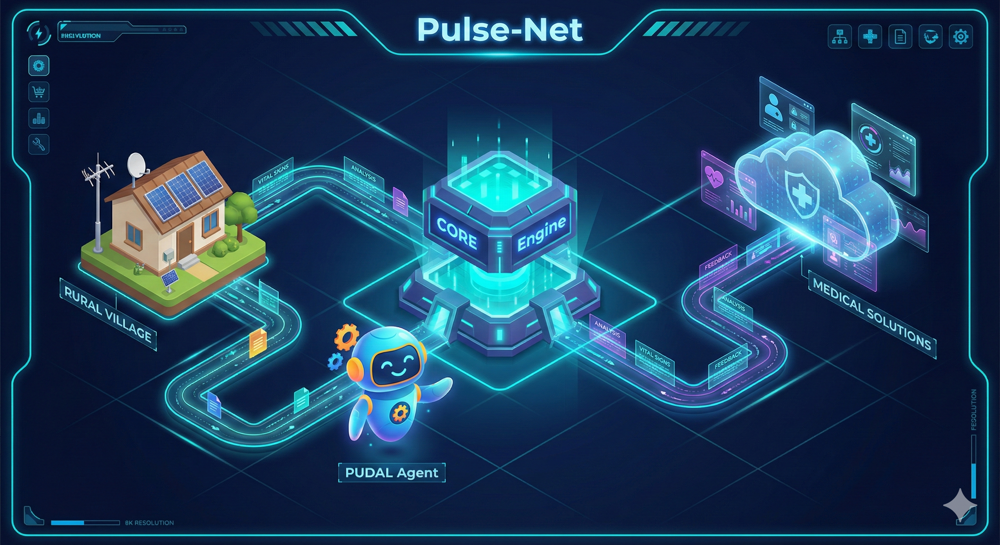

# UAS-3 My Innovations

**Judul: Pulse-Net: Arsitektur "Teater Kerja" Kesehatan Berbasis TISE 2.0**

Inovasi saya, **Pulse-Net**, bukan sekadar aplikasi telemedisin biasa. Ini adalah perwujudan radikal dari paradigma **Triune-Intelligence Smart Engineering (TISE) 2.0**. Jika TISE 1.0 hanya berfokus pada otomatisasi tugas, TISE 2.0 dalam Pulse-Net bertujuan untuk **Pemberdayaan Agensi**.

Tujuannya spesifik: Mengubah 4,5 miliar manusia yang saat ini menjadi "objek penderita" dalam sistem kesehatan, menjadi **Protagonis-Penulis** yang memiliki kendali penuh atas narasi kesehatan tubuh mereka.

Untuk mewujudkan ini, saya merancang **"Teater Kerja" (Work Theater)** digital yang beroperasi di dalam **Sub-Ruang PSKVE** ^6^. Berikut adalah detail arsitektur teknisnya:

### 1. Lingkungan: The Health Work Theater
Dalam konsep Pulse-Net, "rumah sakit" bukan lagi gedung fisik, melainkan sebuah **Teater Kerja Terdesentralisasi**. Ini adalah lingkungan digital-fisik (Cyber-Physical System) tempat terjadinya ko-kreasi nilai kesehatan.
Teater ini memfasilitasi orkestrasi tugas yang kompleks antara pasien (di desa), data medis (di cloud), dan tenaga ahli (di kota), menjembatani kesenjangan antara **Titik A (Kondisi Sakit/Berisiko)** menuju **Titik B (Kondisi Sehat/Terkendali)**. Lingkungan ini dirancang untuk meminimalkan *entropi* (kekacauan/kebingungan) yang sering dialami pasien miskin saat mencari pengobatan.

### 2. Stasion: Transducer Nilai PSKVE
Dalam perjalanan dari Titik A ke Titik B, terdapat "Stasion" fungsional tempat energi diubah menjadi nilai nyata:

* **Sense Station (Stasiun A - Input):** Di sini, **Human Energon** (keluhan rasa sakit, suhu tubuh, detak jantung) ditangkap. Stasiun ini bukan loket pendaftaran, tapi sensor IoT atau antarmuka input sederhana di ponsel yang mentransduksi gejala fisik menjadi **Data Digital**.
* **Heal Station (Stasiun B - Output):** Ini adalah titik terminasi. Di sini, **Knowledge Energon** (algoritma medis) dikonversi kembali menjadi **Service Energon** (instruksi perawatan, resep digital, atau pengiriman drone obat) yang dapat langsung dieksekusi oleh pasien.

### 3. Kendaraan: Agen Otonom "Dr. Saku" (PSA - PUDAL)
Untuk bergerak antar stasion, pasien membutuhkan kendaraan yang cerdas. Saya menciptakan **Agen Pemecah Masalah (Problem Solving Agent - PSA)** ^8^ bernama **"Dr. Saku"**.
Berbeda dengan chatbot statis, Dr. Saku memiliki arsitektur kognitif **PUDAL** yang dinamis:

* **P - Perceive (Persepsi):** Agen membaca input multi-modal (teks keluhan, foto luka, data sensor detak jantung) secara real-time.
* **U - Understand (Pemahaman):** Agen menggunakan *Large Language Models* (LLM) yang dikalibrasi medis untuk memahami konteks lokal (misal: membedakan demam biasa vs gejala malaria endemik setempat).
* **D - Decide (Keputusan):** Agen melakukan **Triase Logis**. Apakah ini butuh *Human Intervention* segera? Apakah cukup *Self-Care*? Keputusan ini berbasis protokol medis ketat untuk menjaga keselamatan.
* **A - Act (Tindakan):** Agen mengeksekusi keputusan: memberikan panduan P3K, menghubungi ambulans desa, atau menjadwalkan telekonsultasi.
* **L - Learning (Pembelajaran):** Agen mengevaluasi hasil tindakan (Feedback Loop). Jika pasien membaik, pola ini disimpan sebagai *Lesson Learned* untuk kasus serupa di masa depan.

### 4. Jaringan Rute: Siklus 7-Langkah Pemecahan Masalah
Agen Dr. Saku tidak bergerak sembarangan. Ia terikat pada **Siklus 7-Langkah Pemecahan Masalah** ^8^ sebagai protokol keselamatan standar:
1.  **Identifikasi:** Mendeteksi anomali (misal: lonjakan suhu tubuh anak).
2.  **Picu (Trigger):** Mengirim sinyal waspada ke orang tua/pasien.
3.  **Kejadian (Event):** Membuka sesi konsultasi (interaksi PUDAL dimulai).
4.  **Baca STATUS:** Menganalisis data vital terkini secara komprehensif.
5.  **Evaluasi:** Membandingkan data dengan *baseline* kesehatan normal pasien.
6.  **Adaptasi:** Menyesuaikan rekomendasi (jika obat A tidak mempan, saran obat B).
7.  **Selesai (Lesson Learned):** Menutup kasus dan mengarsipkan data ke rekam medis elektronik.

### 5. Teknologi: CORE Engine (Mesin Energon)
Jantung mekanis dari Pulse-Net adalah **CORE Engine** ^5^. Ini adalah mesin konseptual yang mengelola efisiensi energi sistem.
Dalam sistem kesehatan konvensional, energinya boros (biaya tinggi, antrean lama). CORE Engine Pulse-Net bekerja dengan siklus:
* **Input:** Data kesehatan masif dari populasi.
* **Encode:** Mengubah data menjadi pola risiko (Risk Pattern).
* **Decode:** Menerjemahkan pola menjadi intervensi preventif yang murah.
* **Output:** **Value Energon** berupa kesehatan masyarakat yang terjaga dengan biaya minimal.

Mesin ini memastikan bahwa **Human Energon** (tenaga dokter) yang terbatas tidak habis untuk hal administratif, tetapi difokuskan sepenuhnya untuk keputusan krusial yang membutuhkan empati *Homocordium*.

### Kesimpulan Arsitektur
Inovasi Pulse-Net adalah sebuah orkestrasi *full-stack*:
Dimulai dari **Riset Medis** (Bahan Bakar), diproses oleh **CORE Engine** (Transducer), dikendarai oleh **Agen PUDAL Dr. Saku** (Kecerdasan), melintasi **Rute 7-Langkah**, di dalam **Teater Kerja Digital**, demi satu tujuan mulia:
Memberdayakan setiap manusia untuk menjadi tuan atas tubuhnya sendiri.

✨ *End of UAS-3 "My Innovations" – Sirojul Firdaus* ✨